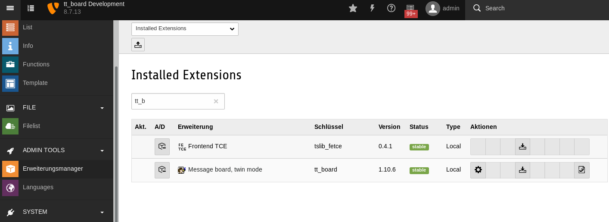

.. include:: ../Includes.txt

.. _admin-manual:

Administrator Manual
====================

**Important**

You must have set this in the constants

.. code-block:: typoscript

    PAGE_TARGET = _top

Some of the TypoScript settings do not function via the constants field, but must be entered in the setup field. Only those settings which can be found using the Constants Editor or in the file Configuration/TypoScript/Default/constants.txt are valid constants. You must include the “Message Board Setup” into your “include static from extensions” of your TYPO3 template setup. The “Message Board CSS styles“ are not required.

Use the flexforms in the plugin entry form to configure the plugin functionality.

To prevent from spammers you must set the memberOfGroups constant to the FE groups to which the FE users must belong to be able to post. If you still want to allow to post for everyone, then unset memberOfGroups.

Example Constants
"""""""""""""""""

.. code-block:: typoscript

    plugin.tt_board { 
       memberOfGroups =
    }

Allow postings to everybody. This might lead to many spam postings! Your provider might then take down your website.

.. _admin-installation:

Installation
------------

To install the extension, perform the following steps:

#. Go to the Extension Manager
#. Install the extension
#. Configure it in the Extension Manager

exclude creator IP
  exclude.tt_board = cr_ip 
  This option disables the IP address for all tt_board records. If unset then the IP address of each post is stored. GDPR can require that you do not record the IP address.
  Here you can enter a comma separated list of fields of the tt_board table which will not be used. `cr_ip` is set by default in order not to store the IP address of the customer client. Remove it if you want to see the IP address of the persons who entered forms.

#. Load the static template

Other configuration
  This other option is for all the rest...

   Extension Manager

   List of extensions within the Extension Manager also shorten with "EM"

.. _admin-configuration:

Configuration
-------------

This extension must be configured in the Extension Manager and in the Constants and Setup.
The Exension Manager shows these options on the tt_board page:

* exclude fields: `basic.exclude.tt_board`

See Installation for more details.

See the chapter Configuration for TypoScript. 

.. _admin-faq:

FAQ
---

No entry form is visible
^^^^^^^^^^^^^^^^^^^^^^^^

memberOfGroups must be set correctly. This is set by default to 1 because of the danger of spam.

