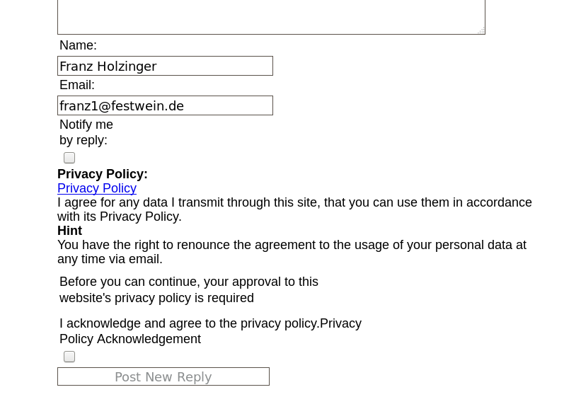

.. include:: ../Includes.txt

.. _admin-manual:

Administrator Manual
====================

Prerequisites
-------------

.. important::

   You must have set :code:`PAGE_TARGET = _top` in the constants

.. code-block:: typoscript

    PAGE_TARGET = _top

Some of the TypoScript settings do not function via the constants field, but must be entered in the 
setup field. Only those settings which can be found using the Constants Editor or in the file 
:file:`Configuration/TypoScript/Default/constants.txt` are valid constants. You must 
include the “Message Board Setup” into your “include static from extensions” of your TYPO3 template 
setup. The “Message Board CSS styles“ are not required. They provide default CSS styles for the forum.

Use the flexforms in the plugin entry form to configure the plugin functionality.

To prevent from spammers you must set the memberOfGroups constant to the FE groups to which the FE users must belong to be able to post. If you still want to allow to post for everyone, then unset memberOfGroups.

Example Constants
"""""""""""""""""

.. code-block:: typoscript

    plugin.tt_board { 
       memberOfGroups =
    }

Allow postings to everybody. This might lead to many spam postings! Your provider might then take down your website.

.. _admin-installation:

Installation
------------

To install the extension, perform the following steps:

#. Go to the Extension Manager
#. Install the extension
#. Configure it in the Extension Manager

exclude creator IP
  exclude.tt_board = cr_ip 
  This option disables the IP address for all tt_board records. If unset then the IP address of each post is stored. GDPR can require that you do not record the IP address.
  Here you can enter a comma separated list of fields of the tt_board table which will not be used. `cr_ip` is set by default in order not to store the IP address of the customer client. Remove it if you want to see the IP address of the persons who entered forms.

#. Load the static template

Other configuration
  This other option is for all the rest...

.. figure:: ../Images/AdministratorManual/ExtensionManager.png
   :alt: Extension Manager

   Extension Manager

   List of extensions within the Extension Manager also shorten with "EM"

.. _admin-configuration:

Configuration
-------------

This extension must be configured in the Extension Manager and in the Constants and Setup.
The Exension Manager shows these options on the tt_board page:

* exclude fields: `basic.exclude.tt_board`

See Installation for more details.

See the chapter Configuration for TypoScript. 

Spam
^^^^

Use the spamWords constant and add your own spam words in the Constants.

Example Constants
"""""""""""""""""

.. code-block:: typoscript

    plugin.tt_board { 
       spamWords := addToList(bad phrase, V1agra, http)
    }

Collect the IP addresses of the users which sent too many spams and protect your whole website by putting those IP addresses into your :file:`.htaccess` file. Or insert it inside of the Directory clauses of an apache config file. See http://www.javascriptkit.com/howto/htaccess5.shtml

Example .htaccess
"""""""""""""""""

.. code-block:: apache

    ...
    order allow,deny
    deny from 195.225.177.12 87.118.112.253 81.177.14.45
    allow from all
    ...

Privacy Policy
^^^^^^^^^^^^^^

You must set the constant :code:`PIDprivacyPolicy` to the page id which shows your DSGVO or GDPR information. This is a legal requirement. You must use a front end registration extension to register the users. They must already have agreed to your privacy policy. 
If you use the forum without logged in front end users, then a privacy policy checkbox will appear in the forum entry form. You can overwrite the default texts by the :code:`_LOCAL_LANG` setup. 

Example Setup
""""""""""""""

.. code-block:: typoscript

    plugin.tt_board_list {
        _LOCAL_LANG.default {
            privacy_policy.title = PRIVACY AGREEMENT
            privacy_policy.acknowledgement = The GDPR is applied.
            privacy_policy.approval_required = You must approve it.
            privacy_policy.acknowledged = You acknowledge to have read the privacy policy.
            privacy_policy.acknowledged_2 = You acknowledge that your entered data may be processed according to GDPR.
            privacy_policy.hint = You can withdraw this again.
            privacy_policy.hint_1 = Just send us an email and your personal data will be removed.
        }
    }

You must alternatively use :code:`plugin.tt_board_tree` for the tree type forum. :code:`plugin.tt_board_list` is only used for the list type forum.

   Override the language texts for the Privacy Policy

   You should use TypoScript to write your own language texts instead of these defaults for anything.

Captcha
^^^^^^^

Install the extension sr_freecap. The default constants is empty. Set the constants to :code:`captcha = freecap`
. This will enable the display of a captcha display in your post forms.
An alternative is the extension captcha. Set the constants to :code:`captcha = captcha”`. 

Files
^^^^^

.. t3-field-list-table::
 :header-rows: 1

 - :Title:        File
   :Description:  Description

 - :Title:        `template folder`
   :Description:  Example templates. 

 - :Title:        `board_template1.tmpl`
   :Description:  default for the static template 'plugin.tt_board_list'.
   
 - :Title:        `board_template2.tmpl`
   :Description:  default for the static template 'plugin.tt_board_tree'.

 - :Title:        `board_template3.tmpl`
   :Description:  listing of the posts in a thread.

.. _admin-faq:

FAQ
---

No entry form is visible
^^^^^^^^^^^^^^^^^^^^^^^^

memberOfGroups must be set correctly. This is set by default to 1 because of the danger of spam.

