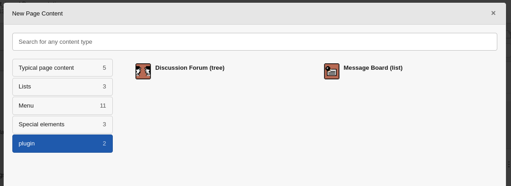
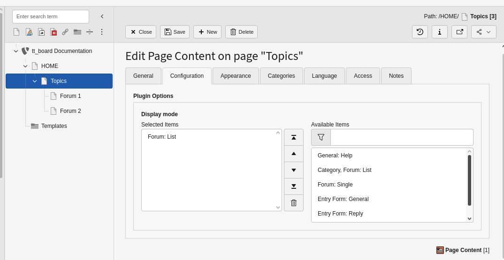
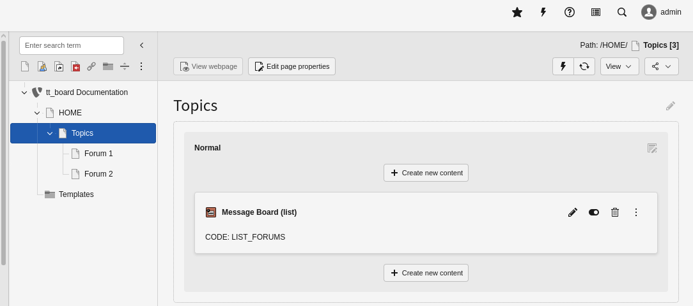

.. include:: ../Includes.txt

.. _user-manual:

Users Manual
============

Installation
------------

1. Install tt_board from the Extension Manager. Maybe the extension must be fetched from TYPO3 TER in the Extension Manager or https://extensions.typo3.org/ by downloading a ZIP file before.

.. figure:: ../Images/UserManual/ActivateExtensionManager.png
   :alt: tt_board in the Extension Manager

   list tt_board in the Extension Manager

   Activate tt_board in the Extension Manager.

2. Check if tt_board has been activated.

.. figure:: ../Images/UserManual/CheckExtensionManager.png
   :alt: tt_board activated in the Extension Manager

   list tt_board in the Extension Manager after activation

   tt_board must be activated in the Extension Manager.

3. The Extension Manager should have activated all the dependant extensions automatically.

.. figure:: ../Images/UserManual/ActivateDependantExtensionManager.png
   :alt: tt_board's depending extensions activated

   list tt_board's depending extensions in the Extension Manager after activation

   tt_board depends on some extensions which are automatically activated in the Extension Manager when tt_board is activated.

4. Choose or add a starting page for the forum.

.. figure:: ../Images/UserManual/ForumStartingPage.png
   :alt: add a starting page

   Each forum needs a starting page.

   Use the TYPO3 backend page module to add a starting page.

5. Add a new content element and choose the Message board plugin.

   The forum needs "Discussion Forum" or a "Message Board" plugin.

   Choose the "Message Board" plugin for this example.

6. Insert the Plugin on your Topics page

   plugin addition

   After the previous step you will see the "General" tab of the content element of the plugin.

7. Select the Forum: List flexform of the Plugin “Board, List”

   forum list plugin addition
   
   From the list of the available items you shall choose "Forum: List" for this example.
   Press the save button.

8. Verify the code in the page modul if it is ‘LIST_FORUMS’.

   forum list code verification
   
   Just to be sure that everything has been accomplished correctly, have a look at the code of the plugin.

9. Add two subpages underneath the Topics page.

.. figure:: ../Images/UserManual/ForumSubPages.png
   :alt: add 2 subpages

   add 2 subpages "Forum 1" and "Forum 2"
   
   Two forum pages are created below the forum starting page.

10. Add a discussion forum to the page “Forum 1”

.. figure:: ../Images/UserManual/Forum1InsertPlugin.png
   :alt: add plugin for message board 1
   
    Add a new content element of the type plugin and subtype "Message Board".

11. Insert the “Forum: Single” and “Entry Form: General” flexforms.

.. figure:: ../Images/UserManual/Forum1InsertDisplayModes.png
   :alt: select the message board 1 display modes
   
    Choose from the available display modes for the "Message Board" (Board / List).

12. Add the Message board to the “Forum 2” page.

.. figure:: ../Images/UserManual/Forum2InsertPlugin.png
   :alt: add plugin for message board 2
   
    Add a new content element of the type plugin and subtype "Message Board".

13. Insert the “Forum: Single” and “Entry Form: General” flexforms.

.. figure:: ../Images/UserManual/Forum2InsertDisplayModes.png
   :alt: select the message board 2 display modes
   
    Choose from the available display modes for the "Message Board" (Board / List).

14. Create an extension template for tt_board in your Templates folder and call it “+ext: tt_board”

.. figure:: ../Images/UserManual/ForumExtensionTemplate.png
   :alt: create an extension template for tt_board

    Add a sysfolder "Templates" and create an empty extension template.

15. Insert Constants and Setup for tt_board.

.. figure:: ../Images/UserManual/ForumExtensionTemplateConstantsSetup.png
   :alt: add the first constants and setup

    Edit the “+ext: tt_board” template and add important constants and setup.

Insert the Constants.

.. code-block:: typoscript

    plugin.tt_board {
        memberOfGroups = 0
    }

Insert the Setup.

.. code-block:: typoscript
    FEData.tt_board.processScript {
    sendToMailingList = 1
        sendToMailingList {
            email = franz@ttproducts.de
            reply = franz@ttproducts.de
            namePrefix = Typo3Forum
            altSubject = Post from my Forum
        }
    }

Use your own e-mail adresses in this example.

16. Add the CSS styles (or use your own CSS file) and the Message Board Setup under “Include static from extensions”.

.. figure:: ../Images/UserManual/ForumExtensionTemplateIncludeStatic.png
   :alt: include static from extensions

    Edit the “+ext: tt_board” template and add the templates "Message Board CSS styles (tt_board)" and "Message Board Setup (tt_board)" on the include tab.

    You can forget about the CSS styles template if you include your own CSS file for tt_board.

17. Edit your master template.

.. figure:: ../Images/UserManual/MasterTemplate.png
   :alt: edit the master template in the Templates sysfolder 

    Open your master template in the Templates sysfolder.
    

18. Include the “+ext: tt_board” from your master template under “Include Basis Template”.

.. figure:: ../Images/UserManual/MasterTemplateIncludeTtBoard.png
   :alt: edit the master template in the tab include 

    You must choose the include tab from the master template and move to the “Include Basis Template” sysfolder symbol. If you click on it then a popup windows shows up. There you choose the “+ext: tt_board” template. This template must be included anywhere into your webpage's template.

19. Check the result.

.. figure:: ../Images/UserManual/MasterTemplateIncludeTtBoardResult.png
   :alt: included basis template "+ext tt_board"

    The master template shows under “Include Basis Template” the extension template "+ext tt_board" as included.

20. The two forums should be visible in the front end now.
.. figure:: ../Images/UserManual/FrontEnd2Forums.png
   :alt: front end view with 2 forums

    The 2 pages of the 2 forums are shown. One forum page is open and it shows the empty forum list, the search entry form and the post entry form.

- What options are available?

Language should be non-technical, explaining, using small examples.
Don't use to many acronyms unless they have been explained.
Don't be confusing by putting information targeting administrators.

.. tip::

   Take a break from time to time.

Admonitions should be used to warn the users about potential
pitfalls, attract their attention to important elements
or just add some notes for for information (further reading,
for example).

.. important::

   Remember to always say "please" when asking your software to
   do something.

Provide screenshots as needed for making things clear. When creating
screenshots, try using the `Introduction Package <http://demo.typo3.org/>`_
as a neutral TYPO3 CMS instance.

.. figure:: ../Images/UserManual/BackendView.png
   :width: 500px
   :alt: Backend view

   Default Backend view (caption of the image)

   The Backend view of TYPO3 after the user has clicked on module "Page". (legend of the image)

.. _user-faq:

FAQ
---

Possible subsection: FAQ
